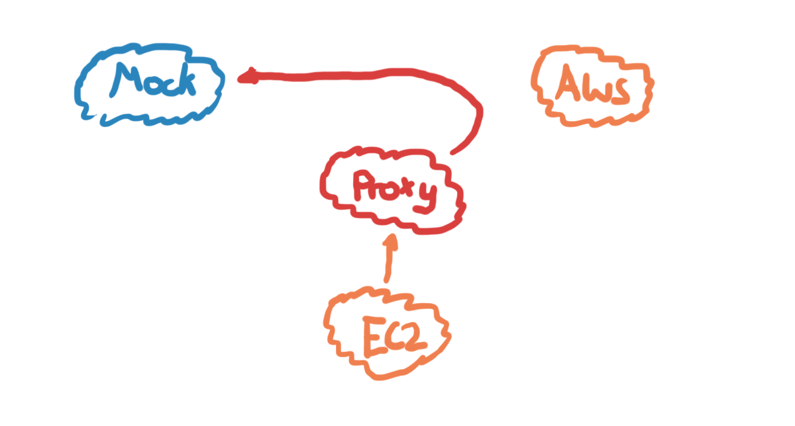

# Example for testing System Manager's Ansible with Localstack and an HTTPS Proxy

## Introduction

In this more complex testing scenario we use again an mock implementation for simulating AWS Services for local testing. Anyhow, this approach is realized by far more transparently, because there is no more need for using endpoint urls. Instead, this approach uses and HTTPS Proxy for transparently redirecting to our AWS Simulation (Mock). Therefore, we need to add a proxy (mitmproxy) as weel as registering the root certificate to our EC2 Simulation, so that the certificates created my our proxy are accepted by our testing implementation.

## About Me

I am a full-blooded software engineer focused on AWS, Cloud, and building high-quality software. I like to learn programming languages and my belief is that multi-lingual language skills can help you to become a better programmer through learning from diverse language concepts. Further, I have interest in developing highly effective and efficient teams.

## Variants

* [HTTP Proxy with Playpack Requests](https://github.com/uwe-h/ansible_proxy_playback)
* [Endpoint Urls](https://github.com/uwe-h/ansible_localstack)

## Disclaimer

This example is just an illustration how you can combine a http proxy for testing ansible. It is not a blueprint for doing productive code or proper unit testing.

## Demo

1. `docker-compose run ec2sim`
1. `./run_tests.sh`

## Implementation

### Http Proxy

* Based on mitmproxy
* Write routing files that forwards *.amazonaws.com to localstack
* Write specific S3 to Localstack logic (e.g., (test-bucket.s3.us-west-1.amazonaws.com --> localstack:4566/test-bucket)

### EC2 Simulation (EC2 Sim)

1. Set HTTPS proxy to your https proxy instance (`docker-compose.yml`)
1. AWS CLI (`Certificate Validation`) and other tools
    1. Copy mitmproxy root cert to `/usr/local/share/ca-certificates` in `ec2/Dockerfile`
    1. `update-ca-certificates`
    1. Use `REQUESTS_CA_BUNDLE` environment variable in `docker-compose.yml` (requests is a python module). AWS CLI comes with own python, so we used this environment parameter here.
1. AWS API with boto3 (`Certificate Validation`) in `ec2/Dockerfile` 
    1. install with `pip` `certifi`
    1. Make the root certificate available for `certifi`

